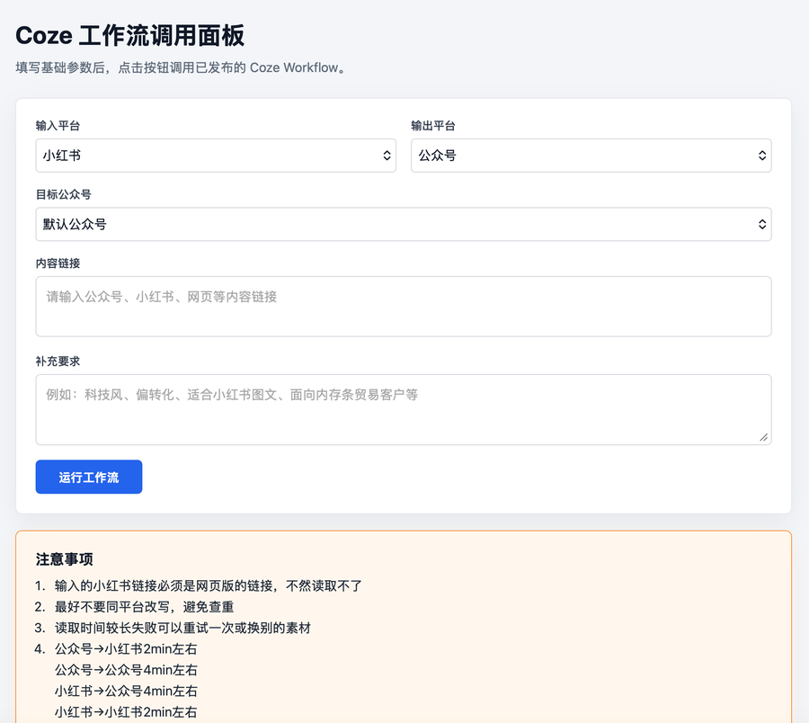
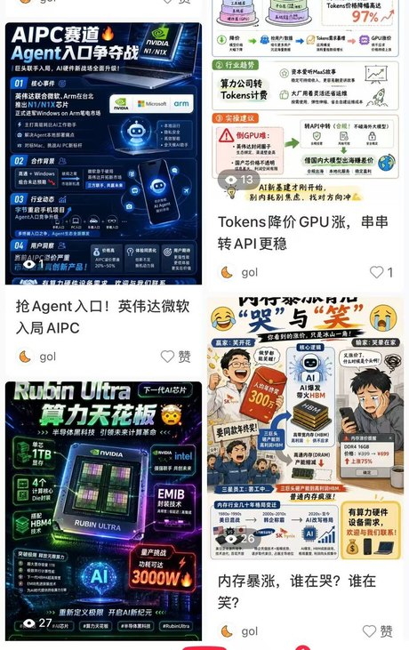
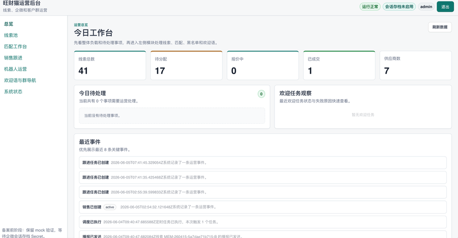
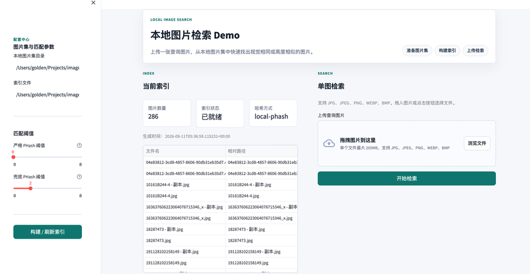
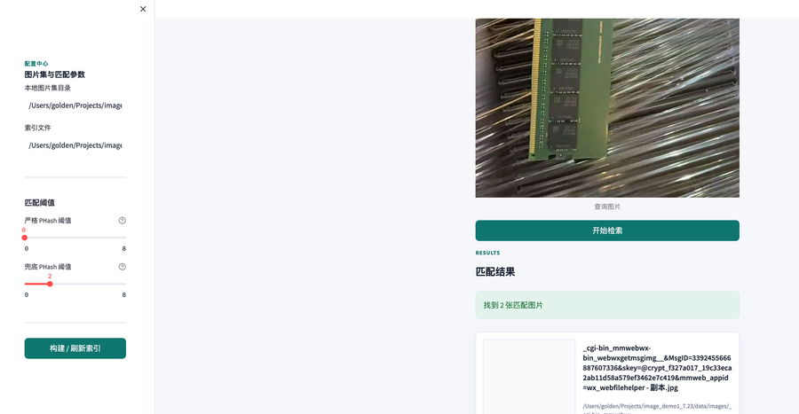

# 邓煜荃 · Yuquan Deng

**AI 应用工程师 · Agent 与工作流自动化方向**
AI Application Engineer · Agents & Workflow Automation

深圳技术大学 · 自动化 · 2026 届
Shenzhen Technology University · Automation · Class of 2026

[项目](#-项目) · [技能栈](#-技能栈) · [联系我](#-联系我) · [English](#-english)

---

## 👋 关于我

我的主线是**把业务问题变成能跑起来的自动化流程**：写后端 API、搭运营台、接企业微信事件回调、编排 Coze 工作流。习惯是把一条链路端到端做实，而不是停在 demo。

- 🎯 **求职方向**：AI 应用工程师 / Agent 开发 / 工作流自动化（2026 届秋招）
- 🔭 **正在深入**：Agent 编排、MCP 协议、多 Agent 协作、RAG
- 🛠️ **做事风格**：先跑通最小闭环，再补契约与适配层；把重复的事做成工具
- 🏋️ 校队健身，长期主义

---

## 🚀 项目

### 1. Coze 工作流 · 多平台内容自动生成

把一篇素材自动改写成小红书图文与公众号推文。前端只暴露必要业务字段，Coze Token 与固定业务参数全部收敛在后端 `.env`，通过流式接口调用已发布工作流。

  

同一批素材产出的小红书图文与公众号推文（标题、正文、配图均由工作流生成）

`Node.js` · `Coze Workflow` · `流式响应解析` · `多公众号配置`

- 设计工作流入参契约：前端字段与工作流入参解耦，固定参数由后端自动补齐
- **密钥不落地前端**：`api_token / app_id / app_secret` 只存在于服务端环境变量
- 支持多公众号配置切换，并保留单账号 fallback 兼容旧配置

**→ [yuquan-deng/coze_auto](https://github.com/yuquan-deng/coze_auto)**

### 2. 企业微信业务应用 · 运营台与事件链路

企微客户群业务应用：消息入站 → 结构化为统一契约 → 分类 → 自动应答 / 建线索 → 运营台可视化。

> 工作项目，公开仓库已做脱敏处理（移除内部运营文档与业务细节）。

`FastAPI` · `React + Vite` · `Webhook` · `适配层抽象` · `pytest`

- **适配层设计**：`mock` 与真实 IM 网关双模式切换，业务代码不感知上游差异
- **事件链路**：成员入群 → 欢迎任务生成 → 定时调度 → 到期执行
- **契约先行**：`InboundMessage`、`ClassificationResult`、`LeadRecord` 结构化对象贯穿全链路
- 零构建控制台 + React 运营台双入口，便于联调与验收

**→ [yuquan-deng/qiweiyy](https://github.com/yuquan-deng/qiweiyy)**

### 3. 本地图像检索 Demo · 相似图召回

不依赖数据库和向量库的本地单图检索原型：构建索引后上传一张查询图，返回视觉相同或高度相似的图片。

`Python` · `Streamlit` · `pHash / DCT` · `OpenCV`

- 索引 286 张图片，`local-phash` 回退实现（跳过 imagededup 这类重依赖，功能保持完整）
- 目录级索引重建、匹配阈值可调，结果展示文件名与相对路径
- 记录了跨机器迁移的实战坑：索引存绝对路径，迁移后必须重建

**→ [yuquan-deng/image_demo](https://github.com/yuquan-deng/image_demo)**

---

## 🧠 技能栈

| 方向 | 具体 |
|---|---|
| **语言** | Python、JavaScript / TypeScript、C / C++、SQL |
| **后端** | FastAPI、Node.js、REST API、Webhook 回调、Pydantic 契约 |
| **前端** | React + Vite、Streamlit、原生 HTML / CSS / JS |
| **AI 与自动化** | Coze 工作流编排、Prompt 工程、OpenAI 兼容 API、结构化输出 |
| **企业微信** | 原生应用开发、事件回调接入、群运营流程、会话存档（协议层） |
| **数据与存储** | MySQL、SQLite、内存仓储与索引 |
| **嵌入式 / 硬件** | STM32、Altium Designer、西门子 PLC、MATLAB / Simulink、COMSOL |
| **工程** | Git / GitHub、Docker、pytest、Windows 与 macOS 双环境开发 |

> 正在学习：MCP 协议、多 Agent 协作、RAG 检索增强。

---

## 📫 联系我

| | |
|---|---|
| 📧 Email | 2200131540@qq.com |
| 💻 GitHub | [github.com/yuquan-deng](https://github.com/yuquan-deng) |

---

## English

**Yuquan Deng** — AI Application Engineer focused on **agents and workflow automation**.
Automation undergraduate at Shenzhen Technology University (Class of 2026), based in Shenzhen, China.

I build end-to-end pipelines rather than demos: FastAPI backends, React consoles, WeCom (WeChat Work)
event callbacks, and Coze workflow orchestration. My usual pattern is to get the minimal closed loop
running first, then add contracts and adapter layers.

**Selected projects**

| Project | What it does | Stack |
|---|---|---|
| [coze_auto](https://github.com/yuquan-deng/coze_auto) | Turns one source article into Xiaohongshu posts and WeChat Official Account articles through a published Coze workflow; all secrets stay server-side | Node.js, Coze Workflow |
| [qiweiyy](https://github.com/yuquan-deng/qiweiyy) | WeCom business application: inbound message → unified contract → classification → lead capture → ops console (sanitized public copy) | FastAPI, React, Vite |
| [image_demo](https://github.com/yuquan-deng/image_demo) | Local single-image retrieval prototype with pHash/DCT indexing — no database, no vector store | Python, Streamlit |

**Tech** — Python, TypeScript, C/C++ · FastAPI, Node.js, React, Streamlit · Coze workflows,
OpenAI-compatible APIs · MySQL, SQLite · Git, Docker, pytest

**Open to** — AI application engineering roles, agent development, workflow automation (graduating 2026)

**Contact** — 2200131540@qq.com · [github.com/yuquan-deng](https://github.com/yuquan-deng)
